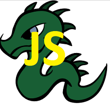

# dragonJs 
__NOTE: JUST STARTED, UNDER DEVELOPMENT IT IS NOT POSSIBLE INSTALL OR USE, ONLY CONTRIBUTION IS NO POSSIBLE RIGHT NOW__

__Kill the dragon by your javascript knowledge (a text game)__



Once upon a time there was a boy who was working as a developer. He was awesome on his filed when he had decided to change his programming skill to NodeJS.

The main idea behind this project is to help people learn javascript. It is intented to be for poeple who like to learn stuff by brutal force - getting as much as possible information in very short time, trying to memorize everything. 


## Stages of the project
- __CLI utility for building question dictionary (Progressing..)__
 - This is the current stage of the project. The target is to create a CLI interface to be able add and edit questions
- Building the dictioary with questions
 - No Game Mode (Just javascript questions)
- Building the dungeon
- Make it game

## How to contribute
As you can probably guess the project is initiated by a person who wants to learn javascript and it will probably not be a big project with huge about of the code. But it really does not mean that contributors are not welcomed - exactly the opposite. Feel free to contribute anytime by anything. 

## Entities
As of now I am commiting everything into the master branch 

### Question
```javascript
## Actual question structure
{
	"question": {
		"id": "1",
		"question_text": "Why is Javascript the best",
		"topics": ["javascriptCore"],
		"difficulty": "1",
		"stage":"1",
		"answers": {
			"answersList": [{
					"answerText": "Because blue elephant cannot drive a car",
					"isCorrect": "0"
				},
				{
					"answerText": "Because PL/SQL is even wrose",
					"isCorrect": "1"
				},
				{
					"answerText": "Because leazy people are supported by the auto-declaring feature",
					"isCorrect": "1"
				}
			]
		}
	}
```

### Topics
As of now the following topics are supported. It is possible to extend it by using / operator to create sub-topic for example javascript-core/regular-expression.

- javascript-core
- node-js
- node-certification
- 70-480
